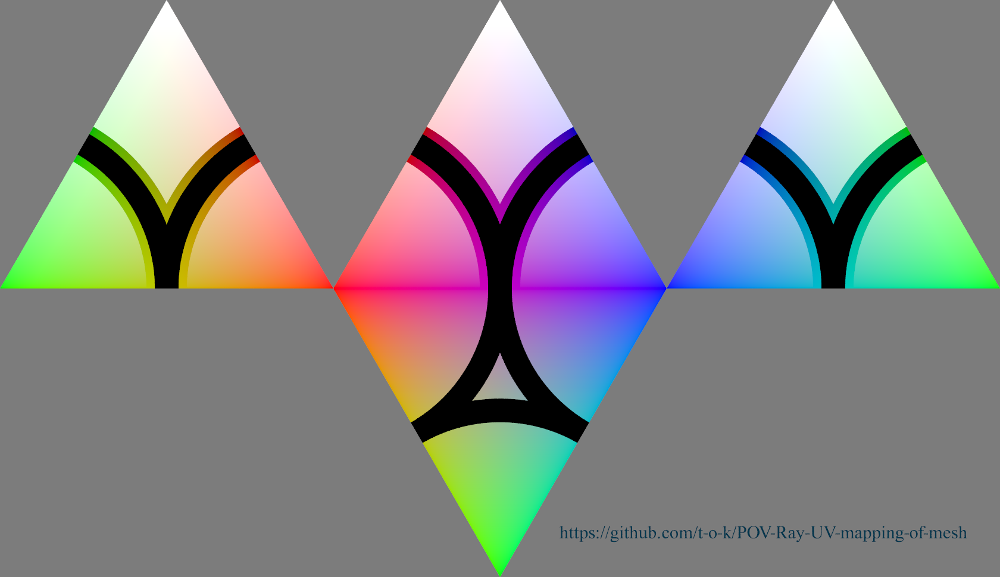
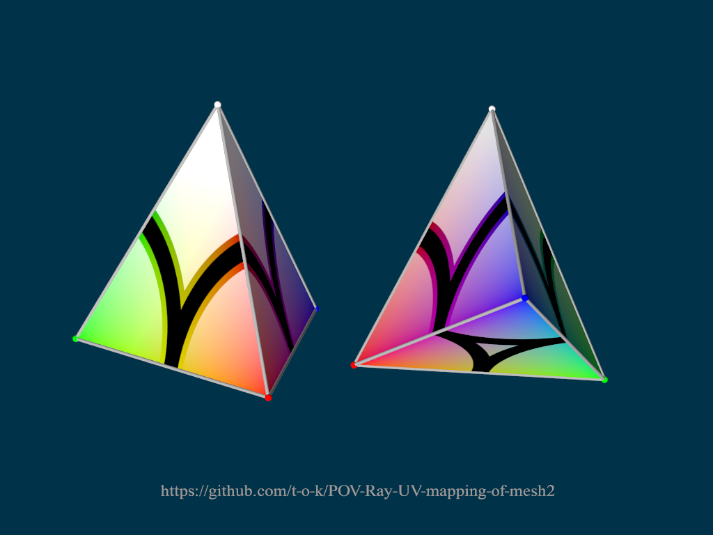

# POV-Ray-UV-mapping-of-mesh2
Example showing UV-mapping of parts of an image onto a mesh2 in POV-Ray

Each of the 4 triangles in the "Image_for_UV-mapping" image is UV-mapped onto one of the 4 triangles that makes up the pyramid in the "UV-mapped_mesh2" image.

[Source code](Image_for_UV-mapping.pov)\

[Source code](UV-mapped_mesh2.pov)\

